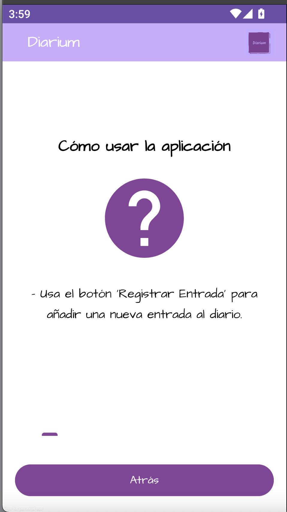

# Diarium

## Descripción
Diarium es una aplicación móvil desarrollada en Android Studio para la asignatura de Laboratorio de Dispositivos Móviles, cuyo propósito es facilitar el registro y gestión de recuerdos personales. Mediante una interfaz sencilla e intuitiva, permite crear y gestionar entradas personalizadas, visualizar contenido multimedia asociado y navegar por un calendario para organizar recuerdos.

## Funcionalidades Principales
1. **Crear y Editar Entradas Personalizadas:**
   - Permite registrar momentos con título, descripción, imágenes y audios.
   - Las entradas se pueden marcar como favoritas, añadir un recordatorio y asociar una fecha específica.

2. **Navegación Optimizada:**
   - Incluye un buscador avanzado para encontrar entradas rápidamente.
   - Un sistema de pestañas facilita la exploración de entradas favoritas, calendario y ayuda.

3. **Visualización de Contenido:**
   - Las imágenes y audios vinculados a las entradas se pueden visualizar y reproducir fácilmente.
   - Integra una galería multimedia enriquecida con animaciones visuales.

4. **Sistema de Favoritos:**
   - Los usuarios pueden destacar las entradas más importantes y acceder a ellas rápidamente.

5. **Interactividad:**
   - Animaciones dinámicas para mejorar la experiencia.
   - Ayuda interactiva con guías paso a paso sobre la funcionalidad de la aplicación.

## Pantallas de la Aplicación
- **Pantalla Principal:**
  Acceso centralizado a todas las funciones: registro de entradas, exploración de favoritas, navegación por el calendario y ayuda.

- **Pantalla de Registro de Entrada:**
  Permite crear nuevas entradas rellenando campos como título, contenido, fecha, favoritos, imágenes y audios.

- **Pantalla de Ver Entradas:**
  Visualización de todas las entradas guardadas, con herramientas para buscarlas, reproducir audios, ver imágenes y eliminarlas.

- **Pantalla de Ver Entradas Favoritas:**
  Similar a la de “Ver Entradas”, pero muestra únicamente las marcadas como favoritas.

- **Pantalla de Calendario:**
  Navega por un calendario mensual donde se muestran las entradas organizadas según la fecha de registro.

- **Pantalla de Ayuda:**
  Sección didáctica que explica cómo utilizar las funcionalidades de la aplicación.

## Tecnologías Utilizadas
1. **Room Database:** Para la gestión eficiente de la persistencia de datos de las entradas.
2. **RecyclerView:** Presentación dinámica de las listas de entradas y multimedia.
3. **Fragments:** Modularización de las pantallas y funcionalidad optimizada.
4. **MediaPlayer:** Reproducción de los audios almacenados.
5. **ConstraintLayout y Animaciones Lottie:** Mejora de la experiencia de usuario.

## Clases Principales
1. **`AppDatabase:`** Clase de acceso a la base de datos local utilizando Room.
2. **`Entry:`** Entidad que representa las entradas de diario con todos sus atributos.
3. **`EntryAdapter:`** Adaptador para vincular datos y visualizarlos en `RecyclerView`.
4. **`CalendarFragment:`** Fragmento encargado de gestionar y mostrar las entradas en formato calendario.
5. **`HelpPagerActivity:`** Pantalla de ayuda estructurada en formato deslizante.
6. **`MediaPlayerSingleton:`** Gestión centralizada de la reproducción de audios.

## Imágenes

*Inicio*

*Añadir entrada 1*

*Añadir entrada 2*

*Ver entradas*

*Ver entradas favoritas*

*Calendario*

*Ayuda 1*

*Ayuda 2*

*Ayuda 3*

*Ayuda 4*

*Ayuda 5*

*Ayuda 6*

*Ayuda 7*

*Ayuda 8*

*Ayuda 9*
